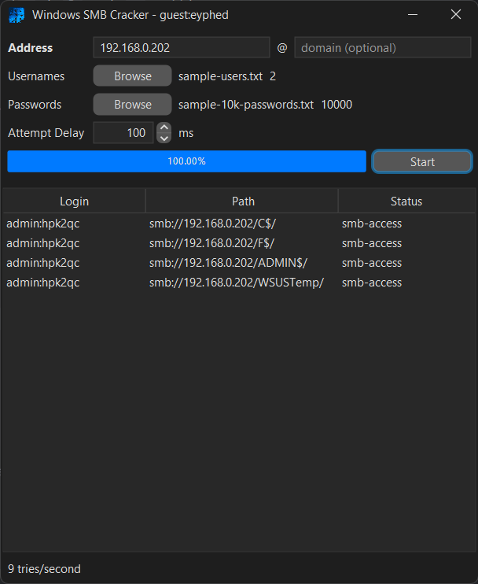

#  windows-smb-cracker


Bruteforce windows accounts remotely through SMB/CIFS and your provided credentials and password lists.



**Success Statuses**

* **local-access**: can be accessed locally
* **smb-access** successfully accessed through smb
* **restricted-access** sign-in works but no remote file access
* **yes** sign-in works no smb or local

## Download

[](https://github.com/mattwright324/jpowder-game/releases)

Be sure to have at least Java 11 installed.

Extract the latest release zip file and run `windows-smb-cracker-yyyyMMdd.HHmmss.jar`.

## Build

Use the clean build commands to test a build. Use the run command to build and run.

```sh
$ ./gradlew clean build
$ ./gradlew run
```

## Package

Run the package command then zip up the `build/package` folder contents for a release.

```sh
$ ./gradlew packageJar
```

## Compatibility

The tables below show which versions of Windows can and cannot be cracked with this tool
and whether or not they have been tested.

In order to crack successfully, you should be able to successfully ping the machine.
When starting the cracker, it will also check if SMB ports are open (137,138,139,445).
A warning-overlay will show asking to continue or cancel the operation.

* **E** stands for "expected to work" when not tested.
* **N** stands for "not expected to work" when not tested.

| Windows               |  Tested  |    Works    | Version | Default CIFS Enabled |
|:----------------------|:--------:|:-----------:|:-------:|:--------------------:|
| Windows 10 v1709+     | &#10003; | &#10003;*** | SMB3.0  |     &#10005;***      |
| Windows 10 v1507-1703 | &#10003; |  &#10003;   | SMB3.0  |       &#10003;       |
| Server 2016           | &#10005; |      E      | SMB3.0  |       &#10003;       |
| Server 2012           | &#10003; |  &#10003;   | SMB3.0  |       &#10003;       |
| Windows 8.1           | &#10005; |      E      | SMB3.0  |       &#10003;       |
| Windows 8             | &#10005; |      E      | SMB3.0  |       &#10003;       |
| Windows 7             | &#10003; |  &#10003;   | SMB2.1  |       &#10003;       |
| Server 2008           | &#10005; |      E      | SMB2.1  |       &#10003;       |
| Windows Vista         | &#10003; |  &#10003;   | SMB2.0  |       &#10003;       |
| Server 2003           | &#10003; |  &#10003;   | SMB1.0  |       &#10003;       |
| Windows XP            | &#10003; | &#10003;**  | SMB1.0  |       &#10003;       |
| Windows ME            | &#10005; |      N      | SMB1.0  |      &#10005;*       |
| Windows 2000          | &#10005; |      N      | SMB1.0  |      &#10005;*       |
| Server 2000           | &#10005; |      N      | SMB1.0  |      &#10005;*       |
| Windows 98            | &#10005; |      N      | SMB1.0  |      &#10005;*       |

* \* CIFS Server must be manually enabled in order to connect.
* \** Windows XP default only accepts "guest" and any password.
* \*** CIFS is no longer installed/enabled by default since Windows 10 1709 and later
  versions, [see here](https://learn.microsoft.com/en-us/windows-server/storage/file-server/troubleshoot/smbv1-not-installed-by-default-in-windows)

### Windows 10 1709+, Windows 11, and later

In testing between two Windows 11 devices, the target device has to have

- Enabled `SMB 1.0/CIFS File Sharing Support` manually in Windows Features
- Enabled `File and printer sharing` in Advanced sharing settings

(Potentially) Your device doing the cracking will also at least need

- Enabled `SMB Client` in Windows Features

Then the cracker was able to successfully test connections, however file access did not work and likely further configuration is needed.